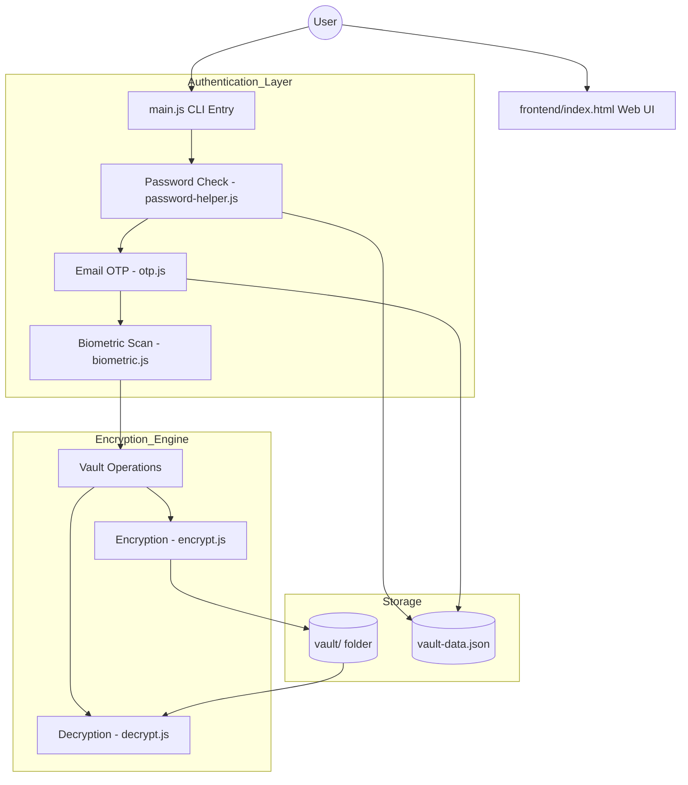

# 🛡️ Secure-Vault

Secure-Vault is a high-security Digital Asset Protection system designed to encrypt and safeguard sensitive files using a recursive three-tier authentication architecture. It combines cryptographic best practices with multi-factor authentication (MFA) to ensure that your data remains private even if your primary password is compromised.

## 🏗️ System Architecture



---

## 📂 Project Structure & File Purpose

### Root Directory
- `main.js`: The central entry point for the Command Line interface.
- `vault-data.json`: The database storing hashed credentials and trusted email lists.
- `package.json`: Project dependencies and configuration.

### 🧠 Backend (`/backend`)
Core logic and cryptographic functions:
- `auth.js`: Orchestrates the 3-step login flow (Password -> OTP -> Biometrics).
- `encrypt.js`: Uses AES-256 to transform any file into a `.svault` protected blob.
- `decrypt.js`: Reverses the encryption given the correct master key.
- `otp.js`: Interfaces with SMTP servers to send secure 6-digit verification codes.
- `password-helper.js`: Handles PBKDF2 password hashing with unique salts.
- `biometric.js`: Hardware-level interface for Windows Hello authentication.
- `crypto-helper.js`: General-purpose utilities for cryptographic operations.

### 🎨 Frontend (`/frontend`)
The premium web dashboard:
- `index.html`: Modern Glassmorphism-based User Interface.
- `style.css`: Premium dark-themed styling with smooth transitions.
- `app.js`: Client-side logic for navigating the vault interface.

### 🧪 Tests (`/tests`)
- `test-otp.js`: Isolated testing for the email delivery system.
- `test-biometric.js`: Isolated testing for the biometric hardware interface.

---

## 🔐 Multi-Tier Security Flow

1.  **Identity Verification (Knowledge)**:
    - User provides a master password.
    - System checks the hash in `vault-data.json` using SHA-512/PBKDF2.
2.  **Possession Verification (OTP)**:
    - A unique 6-digit code is generated and sent to a pre-defined "Trusted Email".
    - User must enter the code within 5 minutes.
3.  **Biological Verification (Biometrics)**:
    - The system requests a Windows Hello (Fingerprint/FaceID) scan.
    - Access is only granted if the hardware confirms the user's physical presence.
4.  **AES-256 Encryption**:
    - Once unlocked, files are encrypted/decrypted using a unique key generated from the session.

---

## 🚀 Getting Started

### Prerequisites
- Node.js installed.
- Gmail App Password (for OTP delivery).

### Setup
1. Clone the repository.
2. Install dependencies:
   ```bash
   npm install
   ```
3. Configure `backend/otp.js` with your Gmail credentials.
4. Run the application:
   ```bash
   node main.js
   ```

### Using the Web UI
Simply open `frontend/index.html` in any modern browser to explore the dashboard.

---

## ⚠️ Security Notice
This project uses **Zero-Knowledge Architecture**. The developers cannot recover your files if you lose your master password. Always keep a secure backup of your restoration keys.
